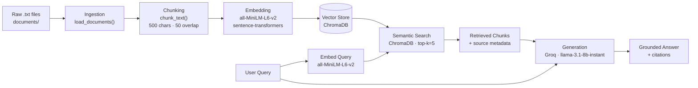

# Project 1 Planning: The Unofficial Guide

> Write this document before you write any pipeline code.
> Your spec and architecture diagram are what you'll use to direct AI tools (Claude, Copilot, etc.) to generate your implementation — the more specific they are, the more useful the generated code will be.
> Update the Retrieval Approach and Chunking Strategy sections if you change your approach during implementation.
> Update this file before starting any stretch features.

---

## Domain

UC Berkeley CS professor and course reviews — student-generated opinions on teaching style, exam difficulty, workload, and course sequencing shared on Reddit, Rate My Professors, and course-specific forums. This knowledge is valuable because official sources like the course catalog describe content but never reflect what it's actually like to take the course or learn from a specific instructor. It's hard to find because it's fragmented across dozens of subreddits and buried in old threads with no unified search.

---

## Documents

| # | Source | Description | URL or location |
|---|--------|-------------|-----------------|
| 1 | Rate My Professors — UC Berkeley CS | Short professor reviews (2–5 sentences each) | https://www.ratemyprofessors.com/school/1072 |
| 2 | r/berkeley — CS 61A professor thread | Reddit thread: student recommendations for CS 61A instructors | https://www.reddit.com/r/berkeley (search: "CS 61A professor") |
| 3 | r/cs61a — advice and megathread | Reddit: tips, workload, exam advice for CS 61A | https://www.reddit.com/r/cs61a |
| 4 | r/cs61b — professor and exam discussion | Reddit: CS 61B workload, projects, professor opinions | https://www.reddit.com/r/cs61b |
| 5 | r/berkeley — CS 170 difficulty thread | Reddit thread on CS 170 exams and difficulty | https://www.reddit.com/r/berkeley (search: "CS 170") |
| 6 | r/berkeley — best CS professors thread | Reddit: general recommendations for CS professors | https://www.reddit.com/r/berkeley (search: "best CS professors") |
| 7 | HKN Course Guide — CS 61A | Long-form student-written course guide | https://hkn.eecs.berkeley.edu/courseguides |
| 8 | HKN Course Guide — CS 61B | Long-form student-written course guide | https://hkn.eecs.berkeley.edu/courseguides |
| 9 | HKN Course Guide — CS 170 | Long-form student-written course guide | https://hkn.eecs.berkeley.edu/courseguides |
| 10 | Berkeleytime reviews — CS 189 (Machine Learning) | Aggregated student course reviews | https://berkeleytime.com |
| 11 | Berkeleytime reviews — CS 61C | Aggregated student course reviews | https://berkeleytime.com |
| 12 | r/berkeley — CS workload tier list | Reddit thread ranking CS courses by workload | https://www.reddit.com/r/berkeley (search: "CS workload tier list") |
| 13 | r/berkeley — enrollment and course selection tips | Reddit thread on course sequencing and registration advice | https://www.reddit.com/r/berkeley (search: "CS course selection") |

---

## Chunking Strategy

**Chunk size:** 500 characters

**Overlap:** 50 characters

**Reasoning:**

Our corpus has three structural types that each pull in different directions:

- **Short reviews** (RMP, Berkeleytime): 2–5 sentences, ~150–400 chars each. Self-contained — never split mid-review.
- **Reddit comments**: 1–5 sentences, ~100–400 chars. Each comment is an independent opinion.
- **HKN guides**: 500–2000 words with section headings. Key facts span sentences; splitting without overlap loses context.

500-character chunks fit a complete short review and ~3–4 sentences of guide text — large enough to capture a complete thought, small enough to isolate individual opinions. The splitting strategy is paragraph-first (split on `\n\n` before falling back to character count) to avoid mid-sentence cuts where possible.

50-character overlap bridges chunk boundaries in long-form guides without over-duplicating content. Short reviews are self-contained so they don't benefit from overlap, but the HKN guides do — 50 chars is the compromise that handles both.

Alternative considered and rejected: per-document-type chunking (reviews split on `---` delimiters, guides split at fixed size). Better retrieval precision in theory but adds branching logic not warranted at this scope. If evaluation reveals retrieval failures tied to chunk boundaries, this would be the first thing to try.

---

## Retrieval Approach

<!-- Which embedding model are you using (e.g., all-MiniLM-L6-v2 via sentence-transformers)?
     How many chunks will you retrieve per query (top-k)?
     If you were deploying this for real users and cost wasn't a constraint, what tradeoffs
     would you weigh in choosing a different embedding model — context length, multilingual
     support, accuracy on domain-specific text, latency? -->

**Embedding model:** `all-MiniLM-L6-v2` via `sentence-transformers`. Already in requirements.txt. 384-dimensional embeddings, 256-token context window — our 500-char chunks (~125 tokens) fit comfortably. Fast, local, and free.

**Top-k:** 5. Enough context for the LLM to synthesize across multiple sources; 5 × 500 chars ≈ 2,500 chars of retrieved context, well within LLaMA's context limit on Groq.

**Production tradeoff reflection:** For a real deployment the main tradeoffs would be: (1) **Accuracy vs. cost** — `text-embedding-3-large` (OpenAI) offers meaningfully higher semantic accuracy but adds API cost and latency; (2) **Local vs. API** — `e5-large-v2` runs locally with better accuracy than MiniLM at the cost of a heavier model download; (3) **Domain specificity** — MiniLM is general-purpose and may not represent jargon like "HKN", "Gitlet", or "NP-completeness" as precisely as a fine-tuned model; (4) **Multilingual support** — not needed here, but `multilingual-e5-large` would be the choice for a broader student population. For this corpus, `all-MiniLM-L6-v2` is the right tradeoff: fast, free, and sufficient for English CS review text.

---

## Evaluation Plan

<!-- List your 5 test questions with their expected correct answers.
     Questions should be specific enough that you can judge whether the system's response
     is right or wrong. "What are good dining halls?" is too vague.
     "What do students say about wait times at [dining hall name] during lunch?" is testable. -->

| # | Question | Expected answer |
|---|----------|-----------------|
| 1 | What do students say about the workload in CS 61B? | Heavy but manageable; projects take 15–25 hrs each; exams are fair if you keep up with projects |
| 2 | Is CS 170 considered one of the harder upper-division CS courses? | Yes — consistently described as theory-heavy with difficult exams; students recommend taking it with a study group |
| 3 | Which CS 61A professor is known for clear explanations? | John DeNero is most consistently praised for clear explanations; his lecture videos are the most frequently recommended resource for CS 61A |
| 4 | What do HKN guides say about how to prepare for CS 61B exams? | Study past exams, understand runtime complexity, don't skip labs |
| 5 | Do students recommend taking CS 189 before or after CS 170? | Most say after — linear algebra and probability need to be solid first (implicit across multiple sources, no single document states this directly) |

---

## Anticipated Challenges

<!-- What could go wrong? Name at least two specific risks with reasoning.
     Consider: noisy or inconsistent documents, missing source attribution, off-topic
     retrieval, chunks that split key information across boundaries. -->

1. **Professor name variants causing retrieval misses.** Students refer to the same instructor as "DeNero", "John DeNero", "denero", or "the 61A prof." If a query uses one form and the stored chunk uses another, semantic similarity may be low enough to miss the relevant chunk. This is the expected mechanism behind evaluation Q3's partial-failure risk.

2. **Short review chunks losing attribution context.** A review saying "He's the best — explains everything clearly" is useless without the professor's name from the surrounding `=== Professor: X ===` header. If chunks are split without preserving header metadata in the chunk text or ChromaDB metadata fields, retrieved chunks will lack source identity and the LLM cannot attribute them. The fix is to prepend each chunk with its source file and professor/course context at ingestion time.

---

## Architecture

---

## AI Tool Plan

<!-- For each part of the pipeline below, describe:
     - Which AI tool you plan to use (Claude, Copilot, ChatGPT, etc.)
     - What you'll give it as input (which sections of this planning.md, which requirements)
     - What you expect it to produce
     - How you'll verify the output matches your spec

     "I'll use AI to help me code" is not a plan.
     "I'll give Claude my Chunking Strategy section and ask it to implement chunk_text()
     with my specified chunk size and overlap" is a plan. -->

**Milestone 3 — Ingestion and chunking:**
Tool: Claude. Input: the Domain section, Documents table, Chunking Strategy section, and a sample of what the `.txt` files look like (the `=== Professor: X ===` header format and `---` separator). Prompt: "Implement `scripts/ingest.py` with `load_documents() -> list[dict]` (each dict has `text`, `source`, `file_path` keys) and `chunk_text(text, chunk_size=500, overlap=50) -> list[str]`, splitting on paragraph boundaries first before falling back to character count." Verify: run the functions on all 13 files and assert no chunk exceeds 500 chars and all chunks are ≥50 chars.

**Milestone 4 — Embedding and retrieval:**
Tool: Claude. Input: the Retrieval Approach section, the output schema from `ingest.py` (`list[dict]` with `text`/`source`/`file_path`), and the ChromaDB getting-started docs. Prompt: "Implement `scripts/embed.py` with `build_index(chunks: list[dict]) -> chromadb.Collection` that embeds chunks using `all-MiniLM-L6-v2` and stores them in ChromaDB with source metadata, and `scripts/retrieve.py` with `retrieve(query: str, collection, k=5) -> list[dict]` returning top-k chunks with their source." Verify: index all chunks, run a known query, confirm top-5 results are topically relevant.

**Milestone 5 — Generation and interface:**
Tool: Claude. Input: the Grounded Generation requirement ("respond only from retrieved chunks, cite source for every claim, say you cannot answer if the context is insufficient"), the `retrieve()` output schema, and `.env.example` showing the Groq key setup. Prompt: "Implement `scripts/generate.py` with `answer_query(query: str, collection) -> str` using Groq's LLaMA model, with a system prompt that forbids answering outside the provided context and requires a citation for every factual claim." Verify: ask a question whose answer is not in the documents and confirm the system declines rather than hallucinating.
